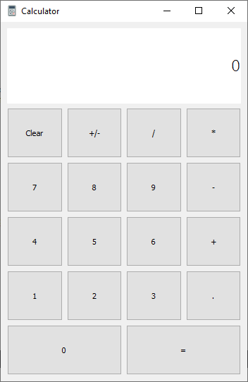

# A Simple Calculator

  

# Description
This application is a calculator capable of calculating basic mathematical operations, such as (/, *, -, +).
It was programmed in C ++ and the graphical user interface was done with Qt, using Qt Designer.